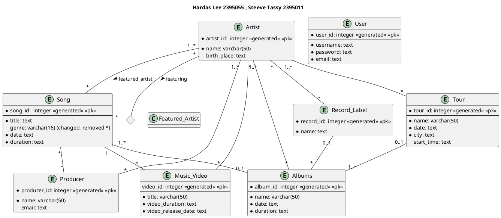

## Logical Model

```plantuml
@startuml

skinparam titleBorderRoundCorner 15 
skinparam classFontSize 15
skinparam classFontName Source Code Pro
hide empty methods

title Hardas Lee 2395055 , Steeve Tassy 2395011


entity User {
* user_id: integer <<generated>> <<pk>>
--
* username: text
* password: text
* email: text
}
entity Artist {
   * artist_id:  integer <<generated>> <<pk>>
--
   * name: varchar(50)
     birth_place: text  
}

entity Albums {
* album_id: integer <<generated>> <<pk>>
--
   * name: varchar(50)
   * date: text
   * duration: text 
}

entity Producer {
* producer_id: integer <<generated>> <<pk>>
--
    * name: varchar(50) 
      email: text         
      }


entity Song {
   * song_id:  integer <<generated>> <<pk>>
--
   * title: text
     genre: varchar(16) (changed, removed *)
   * date: text
   * duration: text   
}

entity Music_Video {
video_id: integer <<generated>> <<pk>>   
--
   * title: varchar(50)
   * video_duration: text  
   * video_release_date: text
}


entity Record_Label {
   * record_id:  integer <<generated>> <<pk>>
--
   * name: text  
}

entity Tour {
    * tour_id: integer <<generated>> <<pk>>
    --
    * name: varchar(50)
    *  date: text
    *  city: text
       start_time: text 
}

<> featured_artist 
Artist "*" - featured_artist : featuring >
featured_artist  -l- "*" Song 
Featured_Artist .l. featured_artist


Artist "1..*" -- "*" Song : featured_artist >
Artist " *  " -- " *" Albums
Artist "1..*   " -- "*" Music_Video
Artist "*" -- "*" Record_Label 
Artist "1..*    " -- " *" Tour  
Artist "  1..*" -- "  *  " Producer 

Song "*" -- "*" Producer 
Song "  1..*     " -- "0..1" Albums 
Song "1 " -- " * " Music_Video 

Record_Label "0..1" -- "*" Albums

Tour "0..1" -- "1..*" Albums


@enduml
```