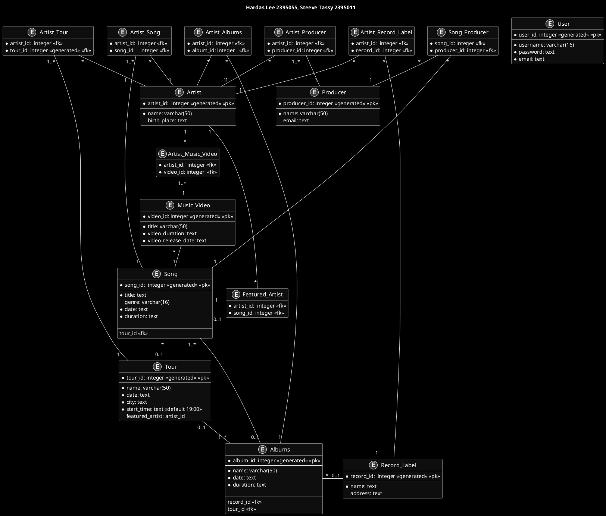

### Physical Diagram 

```plantuml
@startuml

skinparam titleBorderRoundCorner 15 
skinparam monochrome reverse 
skinparam classFontSize 15
skinparam classFontName Source Code Pro
hide empty methods

title Hardas Lee 2395055, Steeve Tassy 2395011


 
entity User {
   * user_id: integer <<generated>> <<pk>>
   --
   * username: varchar(16)
   * password: text
   * email: text
}

entity Artist {
   * artist_id:  integer <<generated>> <<pk>>
   --
   * name: varchar(50)
     birth_place: text
}

entity Tour {
    * tour_id: integer <<generated>> <<pk>>
    --
    *  name: varchar(50)
    *  date: text
    *  city: text
    *  start_time: text <<default 19:00>> 
       featured_artist: artist_id
}

entity Record_Label {
   * record_id:  integer <<generated>> <<pk>>
   --
   * name: text 
     address: text    
}

entity Albums {
   * album_id: integer <<generated>> <<pk>>
   --
   * name: varchar(50)
   * date: text
   * duration: text
    
   --
     record_id <<fk>>
     tour_id <<fk>> 
}

entity Producer {
    * producer_id: integer <<generated>> <<pk>>
    --
    * name: varchar(50)
      email: text
}


entity Song {
   * song_id:  integer <<generated>> <<pk>>
   --
   * title: text
     genre: varchar(16)
   * date: text
   * duration: text 
     
   --
     tour_id <<fk>>      
}

entity Music_Video {
   * video_id: integer <<generated>> <<pk>>   
   --
   * title: varchar(50)
   * video_duration: text
   * video_release_date: text
}


entity Featured_Artist {
    * artist_id:  integer <<fk>>
    * song_id: integer <<fk>>
}

entity Artist_Song {
   * artist_id:  integer <<fk>> 
   * song_id:    integer <<fk>>
}

entity Artist_Albums {
    * artist_id:  integer <<fk>> 
    * album_id: integer   <<fk>>
}

entity Artist_Music_Video {
    * artist_id:  integer <<fk>> 
    * video_id: integer  <<fk>>
}

entity Artist_Record_Label {
    * artist_id:  integer <<fk>>
    * record_id:  integer <<fk>>
}

entity Artist_Tour {
    * artist_id:  integer <<fk>> 
    * tour_id: integer <<generated>> <<fk>>    
}

entity Artist_Producer {
    * artist_id:  integer <<fk>> 
    * producer_id: integer <<fk>>
}

entity Song_Producer {
    * song_id: integer <<fk>>
    * producer_id: integer <<fk>>
} 

'Featured_Artist "0..1"  -- "*" Song :: featuring > 
Featured_Artist "*" -- "1" Artist
Featured_Artist "                           0..1 " -l- " 1    " Song

'Artist "1..*" -- "*" Song : featured_artist >
Artist_Song "*" -- "1" Artist
Artist_Song "1..* " -- " 1 " Song

'Artist " *  " -- " *" Albums
Artist_Albums "    *" -- "                    1" Artist
Artist_Albums "*" -- "1" Albums  

'Artist "1..*   " -- "*" Music_Video
Artist_Music_Video "  * " -u- "1 " Artist
Artist_Music_Video "1..* " -- "1  " Music_Video

'Artist "*" -- "*" Record_Label 
Artist_Record_Label "*" -- "1" Artist
Artist_Record_Label "*" -- "1            " Record_Label

'Artist "1..*    " -- " *" Tour 
Artist_Tour "*" -- " 1          " Artist
Artist_Tour "1..*" -- "1    " Tour 

'Artist "  1..*" -- "  *  " Producer
Artist_Producer "*" -- "1" Artist
Artist_Producer "1..*     " -- "1 "Producer

'Song "*" -- "*" Producer
Song_Producer "*" -- "1" Song
Song_Producer "   *         " -- "1     " Producer


Song "  1..*     " -- "0..1" Albums
Song "1" -u- "          *   " Music_Video 

Tour "0..1" -- "1..*" Albums
Tour "0..1 " -u- " * " Song

Record_Label "0..1" -l- "*" Albums


@enduml
```